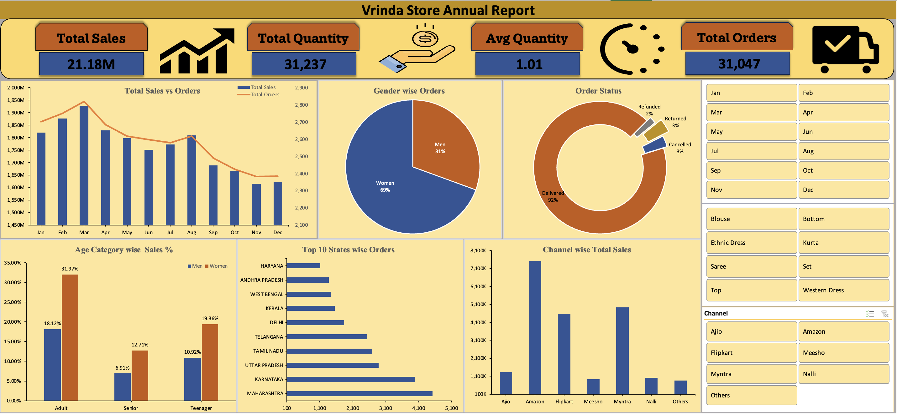
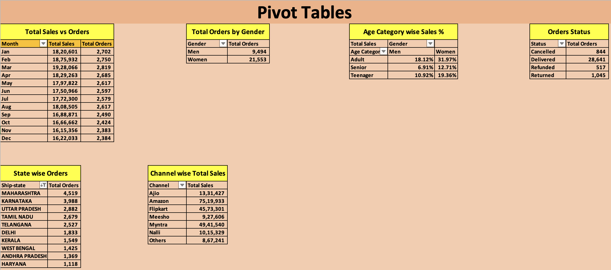
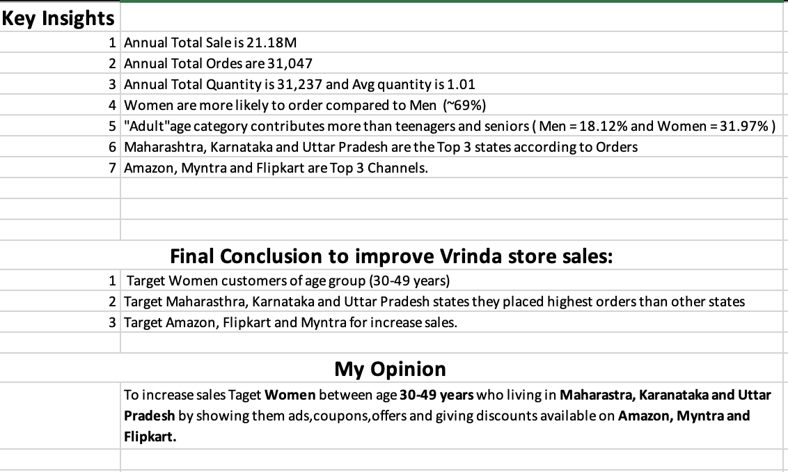

# Vrinda-Store-Sales-Analysis
# 📊 Vrinda Store Sales Analysis (Excel Dashboard Project)

## 🧾 Project Overview
This project analyzes Vrinda Store's annual sales performance using Excel.  
The dashboard provides insights into sales trends, customer behavior, state-wise performance, and channel effectiveness.

---

# 📌 KPIs

- Total Sales: 21.18M
- Total Orders: 31,047
- Total Quantity Sold: 31,237
- Average Quantity per Order: 1.01

---

# 📊 Dashboard

### Key Highlights:
- Women contribute ~69% of total orders
- Adult category contributes highest sales
- Maharashtra, Karnataka & Uttar Pradesh are top states
- Amazon, Myntra & Flipkart are top performing channels
- 92% orders successfully delivered

---

# 📈 Pivot Tables

Includes:
- Sales vs Orders by Month
- Gender-wise Orders
- Age Category Sales %
- State-wise Orders
- Channel-wise Sales
- Order Status Breakdown

---

# 💡 Business Insights

### Recommendations:
- Target Women aged 30–49
- Focus marketing in Maharashtra, Karnataka & Uttar Pradesh
- Invest more in Amazon, Myntra & Flipkart
- Run promotional campaigns for high-performing categories

---

# 📂 Download Full Excel File

[Click here to download full Excel project](vrinda_store_sales_analysis.xlsx)

---

# 🛠 Tools Used
- Microsoft Excel
- Pivot Tables
- Slicers
- Data Cleaning
- KPI Cards
- Dashboard Design
